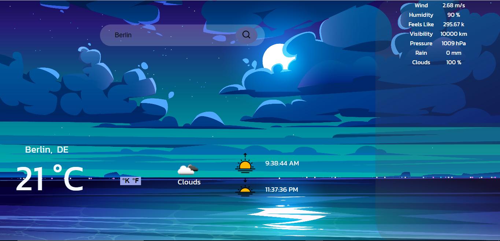
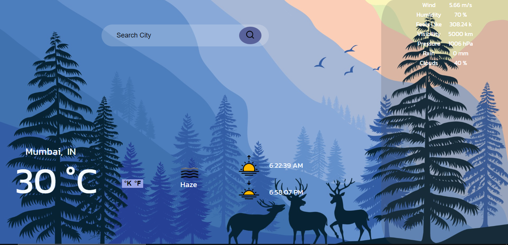

<h1>Weather App</h1> 

A Single Page Application that shows weather powered by OpenWeatherMap

<h2>Tech </h2>
<ul>
<li><a href="https://www.w3.org/html/">HTML<a></li>
<li><a href="https://www.w3.org/Style/CSS/current-work.en.html">CSS</a></li>
<li><a href="https://developer.mozilla.org/en-US/docs/Web/JavaScript">JavaScript</a></li>
<li><a href="https://openweathermap.org/"> OpenWeatherMap </a> </li>
</ul>

<h2>How To Use?</h2>
<ol>
<li>Clone this repository.</li>
<li>Insert your API Key into script.js under the variable <code>apiKey</code>. </li>
<li>Open <code>index.html</code> in Web Browser.</li>
</ol>

<h2>Screenshots</h2>

 

